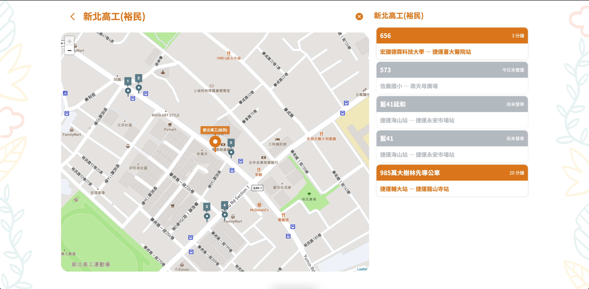

<h1 align="center">
  <a href="https://github.com/Rabbittee/F2E-Bus-Frontend">
    
  </a>
</h1>

<div align="center">
  Taiwan Bus Search
  <br />
  <a href="#about"><strong>Explore the screenshots »</strong></a>
  <br />
  <br />
  <a href="https://github.com/Rabbittee/F2E-Bus-Frontend/issues/new?assignees=&labels=bug&template=01_BUG_REPORT.md&title=bug%3A+">Report a Bug</a>
  ·
  <a href="https://github.com/Rabbittee/F2E-Bus-Frontend/issues/new?assignees=&labels=enhancement&template=02_FEATURE_REQUEST.md&title=feat%3A+">Request a Feature</a>
  .<a href="https://github.com/Rabbittee/F2E-Bus-Frontend/discussions">Ask a Question</a>
</div>

<div align="center">
<br />

[](LICENSE)

[](https://github.com/Rabbittee/F2E-Bus-Frontend/issues?q=is%3Aissue+is%3Aopen+label%3A%22help+wanted%22)

</div>

<details open="open">
<summary>Table of Contents</summary>

- [About](#about)
  - [Built With](#built-with)
- [Getting Started](#getting-started)
  - [Prerequisites](#prerequisites)
  - [Installation](#installation)
- [Usage](#usage)
- [Roadmap](#roadmap)
- [Support](#support)
- [Project assistance](#project-assistance)
- [Contributing](#contributing)
- [Authors & contributors](#authors--contributors)
- [Security](#security)
- [License](#license)
- [Acknowledgements](#acknowledgements)

</details>

---

## About

A bus search application for providing bus information in Taiwan.

Which let you:

- Find bus station or route information by search terms.
- Find the closest bus station near you by searching your location.

Our goal is providing more easiest and fastest way to get the bus information,
with clean UI / UX and reliable software system.

<details>
<summary>Screenshots</summary>
<br>

> **[?]**
> Please provide your screenshots here.

|                                 Home Page                                  |                                   Station Page                                   |                                  Route Page                                  |
| :------------------------------------------------------------------------: | :------------------------------------------------------------------------------: | :--------------------------------------------------------------------------: |
|  |  |  |

</details>

### Built With

#### Frontend

React based project with Typescript.

- Vite
- Tailwindcss
- React
- React Router
- Redux with RTK-Toolkit
- Leaflet
- Mapbox API
- Framer Motion
- date-fns
- ramda
- Vercel

#### Backend

Python with FastAPI Framework.

- Poetry
- FastAPI
- Google Geocoding
- Redis
- GCP CloudRun

## Getting Started

### Prerequisites

Please make sure you already have:

- [NodeJS](https://nodejs.org/)
- [Yarn](https://yarnpkg.com/)

### Installation

```bash
npm install
```

or using

```bash
yarn
```

## Develope

```bash
npm run dev
```

or using

```bash
yarn dev
```

which will open [https://localhost:3000](https://localhost:3000) for this project,

**NOTICE**
Because we using `Geolocation API`,
this feature is available only in secure contexts (HTTPS),
please make sure run on `https` for local development.

## Roadmap

See the [open issues](https://github.com/Rabbittee/F2E-Bus-Frontend/issues) for a list of proposed features (and known issues).

- [Top Feature Requests](https://github.com/Rabbittee/F2E-Bus-Frontend/issues?q=label%3Aenhancement+is%3Aopen+sort%3Areactions-%2B1-desc) (Add your votes using the 👍 reaction)
- [Top Bugs](https://github.com/Rabbittee/F2E-Bus-Frontend/issues?q=is%3Aissue+is%3Aopen+label%3Abug+sort%3Areactions-%2B1-desc) (Add your votes using the 👍 reaction)
- [Newest Bugs](https://github.com/Rabbittee/F2E-Bus-Frontend/issues?q=is%3Aopen+is%3Aissue+label%3Abug)

## Support

Reach out to the maintainer at one of the following places:

- [GitHub Discussions](https://github.com/Rabbittee/F2E-Bus-Frontend/discussions)
- Contact options listed on [this GitHub profile](https://github.com/kayac-chang)

## Project assistance

If you want to say **thank you** or/and support active development of Taiwan Bus Search:

- Add a [GitHub Star](https://github.com/Rabbittee/F2E-Bus-Frontend) to the project.
- Tweet about the Taiwan Bus Search.
- Write interesting articles about the project on [Dev.to](https://dev.to/), [Medium](https://medium.com/) or your personal blog.

Together, we can make Taiwan Bus Search **better**!

## Contributing

First off, thanks for taking the time to contribute! Contributions are what make the open-source community such an amazing place to learn, inspire, and create. Any contributions you make will benefit everybody else and are **greatly appreciated**.

Please read [our contribution guidelines](docs/CONTRIBUTING.md), and thank you for being involved!

## Contributors

For a full list of all authors and contributors, see [the contributors page](https://github.com/Rabbittee/F2E-Bus-Frontend/contributors).

## Security

Taiwan Bus Search follows good practices of security, but 100% security cannot be assured.
Taiwan Bus Search is provided **"as is"** without any **warranty**. Use at your own risk.

_For more information and to report security issues, please refer to our [security documentation](docs/SECURITY.md)._

## License

This project is licensed under the **GNU General Public License v3**.

See [LICENSE](LICENSE) for more information.

## Acknowledgements

Thanks you very much, can't bring this project out without:

- [六角學院](https://www.hexschool.com/)
- [交通部運輸資料流通服務](https://tdx.transportdata.tw/)
